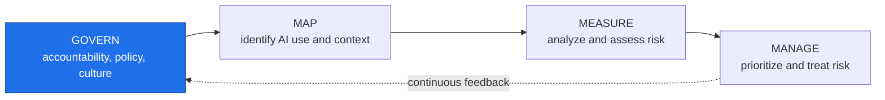
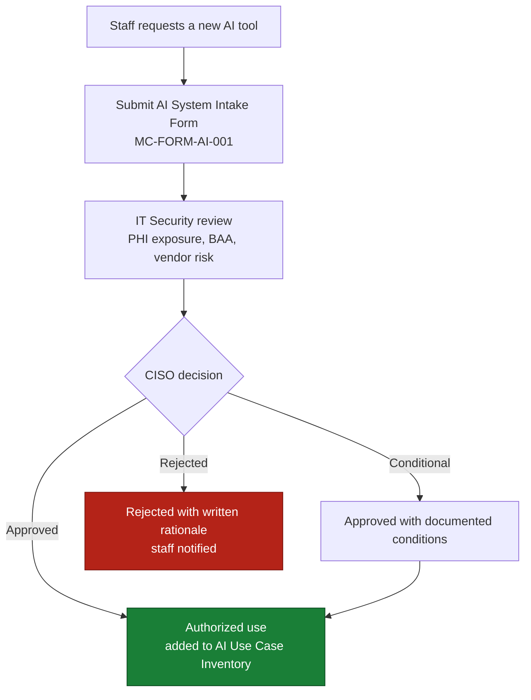
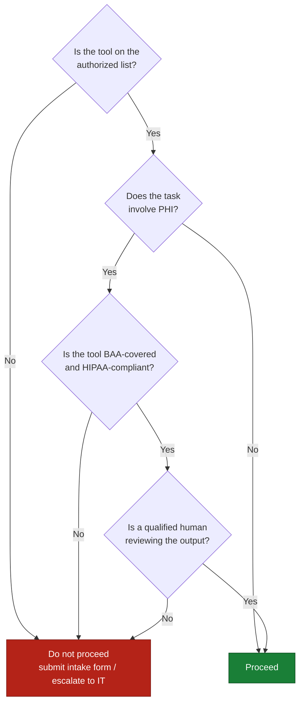
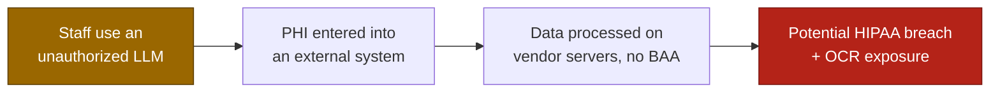
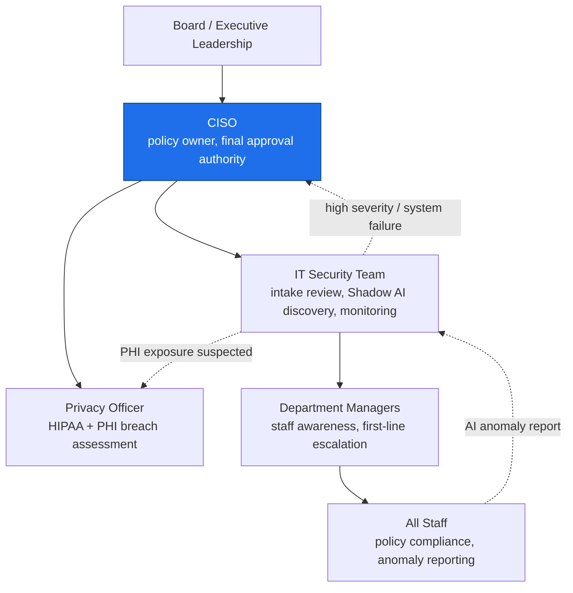

# MC-POL-AI-001 - Artificial Intelligence Acceptable Use Policy

**MedCore Health Systems**
*Internal Policy Document - Version 1.0*

---

## 1. Purpose

Artificial intelligence (AI) tools, encompassing large language models (LLMs), AI-assisted diagnostic systems, and automated decision-support software, are increasingly accessible to MedCore Health Systems personnel. However, without explicit guidance, their utilization poses substantial risks to patient privacy, data integrity, regulatory compliance, and organizational security.

This policy delineates the guidelines for the utilization of artificial intelligence (AI) tools within MedCore Health Systems. Its primary objective is to enable staff access to AI capabilities while protecting patients, the organization, and the integrity of clinical and administrative processes.

This policy is aligned with the **NIST AI Risk Management Framework (AI RMF 1.0)** GOVERN function and supports MedCore's obligations under **HIPAA** and **HITECH**.

### Data: Shadow AI in Healthcare

A December 2025 Wolters Kluwer Health survey of 500+ healthcare workers found that **17% admitted to using unauthorized AI tools at work**, and more than **40% were aware of colleagues doing the same**. 

Approximately 1 in 10 reported using unauthorized AI for direct patient care. Healthcare remains the most expensive industry for data breaches for the 14th consecutive year, with an average breach cost of **$7.42 million** (IBM Cost of a Data Breach Report 2025) and a mean containment time of **279 days**.

**Sources:** [Wolters Kluwer Shadow AI in Healthcare survey (2025)](https://www.wolterskluwer.com/en/news/wolters-kluwer-survey-finds-broad-presence-of-unsanctioned-ai-tools-in-hospitals-and-health-systems) · [IBM Cost of a Data Breach Report 2025 (healthcare)](https://www.hipaajournal.com/average-cost-of-a-healthcare-data-breach-2025/)

**Where this policy sits in the NIST AI RMF 1.0:**

*This Acceptable Use Policy is a GOVERN-function control.*

---

## 2. Scope

This policy applies to:

- All MedCore Health Systems employees, contractors, volunteers, and third-party vendors
- All AI tools used in connection with MedCore systems, data, networks, or workflows - regardless of whether those tools are organization-issued, vendor-provided, or personally owned
- All locations where MedCore work is performed, including on-site, remote, and hybrid environments

This policy covers but is not limited to: large language models (e.g., ChatGPT, Claude, Gemini, Copilot), AI-powered diagnostic tools, automated coding and billing assistants, AI scheduling and intake systems, and AI-generated content used in clinical or administrative communications.

---

## 3. Definitions

| Term                                   | Definition                                                                                                                                                                           |
| -------------------------------------- | ------------------------------------------------------------------------------------------------------------------------------------------------------------------------------------ |
| **Artificial Intelligence (AI)**       | Software systems that execute tasks commonly requiring human intelligence, encompassing natural language processing, image recognition, decision support, and predictive analytics   |
| **Large Language Model (LLM)**         | An artificial intelligence (AI) system trained on extensive text datasets to produce, condense, translate, or analyze textual content (e.g., ChatGPT, Claude, Gemini).               |
| **Protected Health Information (PHI)** | Any individually identifiable health information held or transmitted by MedCore, as defined under the Health Insurance Portability and Accountability Act (HIPAA) (45 CFR §160.103). |
| **Shadow AI**                          | Any artificial intelligence tool utilized by staff without undergoing a formal IT review, security assessment, or organizational approval.                                           |
| **Authorized AI System**               | An AI tool that has undergone a thorough review, risk assessment, and formal approval by the IT department and the Chief Information Security Officer (CISO) before its deployment.  |
| **AI Operator**                        | A MedCore staff member who utilizes an authorized AI system as part of their responsibilities.                                                                                       |
| **Model Drift**                        | The gradual decline in the accuracy and reliability of an artificial intelligence model as real-world data patterns undergo transformations.                                         |
| **Prompt Injection**                   | An attack where malicious input manipulates an AI system into producing unintended or harmful outputs.                                                                               |
| **Human-in-the-Loop (HITL)**           | A design requirement mandates that a qualified human review and approve AI-generated outputs before any action is taken.                                                             |

---

## 4. Authorized AI Systems

Only AI systems that have completed MedCore's **AI System Intake and Risk Assessment** process may be used for organizational purposes.

### 4.1 Current Authorized Systems

| System | Use Case | PHI Permitted | Oversight Requirement | Status |
|--------|----------|--------------|----------------------|--------|
| AutoCode Billing Assistant | Medical billing code suggestions | Limited (billing records only) | Human review required before submission | Conditionally Authorized |
| PatientFlow Chatbot | Appointment scheduling and intake | Minimum necessary only | IT monitoring; escalation to staff for clinical queries | Under Evaluation |
| DiagnoAI Imaging Assistant | Diagnostic imaging support | Yes - imaging data | Physician sign-off required on all outputs | Under Evaluation |

*For a complete and current list, see the AI Use Case Inventory (MC-INV-AI-001).*

### 4.2 Requesting a New AI System

Staff who wish to use an AI tool not listed above must submit an **AI System Intake Form** (MC-FORM-AI-001) to IT before use. Unauthorized use pending review is prohibited.

**AI system intake and approval path:**

---

## 5. Prohibited Uses

The following uses of AI are **strictly prohibited** at MedCore Health Systems:

### 5.1 PHI in Unauthorized AI Systems
Staff **must not** input, upload, paste, or verbally dictate any Protected Health Information (PHI) into any AI system that has not been formally authorized and confirmed HIPAA-compliant by MedCore IT.

**Real Incident: Third-Party Breach Liability**

The May 2025 Covenant Health ransomware attack compromised the records of 478,188 patients, leading the Qilin group to exfiltrate approximately 852 GB of data. Although the breach originated within Covenant’s IT environment, it highlights the principle that when Protected Health Information (PHI) is transferred from an organization’s controlled systems, the covered entity assumes liability. As per the HIPAA Security Rule, covered entities are accountable for the actions of their Business Associates. An AI vendor processing PHI without a signed Business Associate Agreement (BAA) creates the same direct OCR exposure as any other unmanaged third party. In January 2025, the Health and Human Services Office for Civil Rights (HHS OCR) proposed the first significant HIPAA Security Rule update in two decades, explicitly requiring AI tools to be included in required risk analyses. This update eliminates any ambiguity regarding whether AI use falls within the scope of the rule.

**Sources:** [HIPAA Journal, Covenant Health cyberattack (2025)](https://www.hipaajournal.com/covenant-health-cyberattack/) · [HHS OCR HIPAA Security Rule NPRM (January 2025)](https://www.federalregister.gov/documents/2025/01/06/2024-30983/hipaa-security-rule-to-strengthen-the-cybersecurity-of-electronic-protected-health-information)

This includes but is not limited to:
- Copying patient notes, diagnoses, or treatment plans into public LLMs (e.g., ChatGPT, Claude.ai, Gemini)
- Uploading patient records, lab results, or imaging reports to AI tools for summarization
- Using AI transcription tools that transmit audio to external servers without a signed Business Associate Agreement (BAA)

### 5.2 Proprietary or Confidential Data
Staff **must not** enter MedCore's proprietary information - including internal financial data, unreleased strategic plans, vendor contracts, or staff personnel records - into any external AI system.

### 5.3 Unsupervised AI Decision-Making in Clinical Contexts
AI systems **must not** be used to make autonomous clinical decisions without Human-in-the-Loop (HITL) review. All AI-generated clinical recommendations must be reviewed and approved by a licensed clinician before being acted upon.

### 5.4 Circumventing Security Controls
Staff **must not** use AI tools to bypass, disable, or work around MedCore's security controls, monitoring systems, or access restrictions.

### 5.5 Generating Misleading or Fraudulent Content
Staff **must not** use AI to generate false clinical documentation, fabricated patient records, or fraudulent billing codes.

### 5.6 Personal Use on MedCore Systems
Use of AI tools on MedCore devices or networks for purely personal purposes unrelated to job responsibilities is prohibited.

---

## 6. Approved Use Guidelines

When using authorized AI systems, staff must follow these guidelines:

**Quick reference - "Can I use AI for this task?"**

### 6.1 Minimum Necessary Standard
Apply the HIPAA Minimum Necessary Standard to all AI interactions. Only provide the AI system with the data required to complete the specific task. Do not input full patient records when a single field will suffice.

### 6.2 Always Review AI Output
AI outputs must be treated as **drafts, not final decisions**. Staff are responsible for reviewing, validating, and taking accountability for any AI-generated content used in clinical documentation, billing, or patient communications.

### 6.3 Do Not Rely on AI for Safety-Critical Decisions Alone
For any decision that directly affects patient safety - medication dosing, diagnostic conclusions, care pathway changes - AI output must be reviewed by a qualified clinician. This requirement cannot be waived.

### 6.4 Be Aware of Hallucinations
AI systems can generate confident but factually incorrect outputs (known as "hallucinations"). Staff must cross-reference AI-generated clinical information against authoritative sources before acting on it.

### 6.5 Maintain Audit Trails
Where technically possible, staff should retain logs or records of AI interactions related to patient care decisions. This supports accountability and supports incident investigation if needed.

---

## 7. Data Classification and PHI Rules

| Data Type | Examples | May Be Used with Authorized AI? | May Be Used with Unauthorized AI? |
|-----------|----------|--------------------------------|----------------------------------|
| PHI - Identifiable | Full name + diagnosis, DOB + treatment | Only with HIPAA-compliant, BAA-covered systems | **Never** |
| PHI - De-identified | Aggregate stats, anonymized case studies | Yes, with care | No |
| Internal Confidential | Strategic plans, financials, personnel | No external AI | **Never** |
| General Business | Public-facing content, non-sensitive admin | Authorized systems only | No |

**When in doubt, do not input the data.** Contact IT Security at [security@medcorehealthsystems.org] for guidance.

---

## 8. Shadow AI - Unauthorized Tool Use

MedCore defines **Shadow AI** as any AI tool used by staff without completing the AI System Intake process.

Shadow AI is one of MedCore's highest-priority AI risks. Unauthorized LLM use has been observed across healthcare organizations at scale, with staff using public AI tools to summarize clinical notes, draft patient communications, and process billing data - often without awareness of the PHI exposure this creates.

**Data: Shadow AI Prevalence**

Across various industries, 67% of employees report using AI tools at work, while only 18% of companies have a formal AI security policy (Red Team Partner, 2025). The significant gap between AI adoption and governance is the primary concern in the realm of Shadow AI. In healthcare, for instance, 45% of staff who used unauthorized AI cited faster workflow as their primary motivation (Wolters Kluwer, 2025). This highlights that the issue of Shadow AI is not rooted in malicious intent but rather in a governance gap. The direct implication of addressing this gap is that providing approved, enterprise-grade AI tools eliminates the incentive for employees to resort to unauthorized ones.

**Sources:** [Red Team Partner Shadow AI Enterprise Risk Report (2025)](https://redteampartner.com/blog/shadow-ai-enterprise-risk/) · [Wolters Kluwer Shadow AI in Healthcare survey (2025)](https://www.wolterskluwer.com/en/news/wolters-kluwer-survey-finds-broad-presence-of-unsanctioned-ai-tools-in-hospitals-and-health-systems)

**The Shadow AI risk chain - from behavior to regulatory consequence:**

### 8.1 Reporting Shadow AI
Staff who become aware of unauthorized AI tool use - by themselves or colleagues are expected to report it through MedCore's **AI Anomaly Reporting Channel** (see Section 9). Reports are confidential and will not result in punitive action for good-faith disclosures.

### 8.2 Self-Disclosure
Staff who have been using an unauthorized AI tool and wish to disclose are encouraged to do so proactively. Self-disclosure before a security incident occurs will be treated more favorably than discovery after an incident.

---

## 9. Reporting and the AI Anomaly Reporting Channel

MedCore operates a **non-punitive AI Anomaly Reporting Channel** for staff to report:

- Suspected Shadow AI use
- Unexpected, erroneous, or potentially harmful AI outputs ("hallucinations")
- Suspected data exposure or PHI leakage through an AI system
- Prompt injection attempts or suspicious AI behavior
- Any AI-related security concern

**How to report:**
- Email: [ai-safety@medcorehealthsystems.org]
- Internal ticket: IT Security Portal → "AI Anomaly Report"
- Verbally: Any direct manager or IT Security staff member

Reports will be triaged by IT Security within 1 business day. If a report involves potential PHI exposure, it will be escalated to the Privacy Officer immediately.

---

## 10. Governance and Accountability

| Role                    | Responsibility                                                                                   |
| ----------------------- | ------------------------------------------------------------------------------------------------ |
| **CISO**                | Policy owner; final authority on AI system approvals; escalation point for AI security incidents |
| **Privacy Officer**     | HIPAA compliance oversight, PHI breach assessment for AI-related incidents                       |
| **IT Security Team**    | AI system intake review, Shadow AI discovery, monitoring authorized systems                      |
| **Department Managers** | Ensuring staff awareness of this policy, first-line escalation for AI concerns                   |
| **All Staff**           | Following this policy, reporting anomalies; completing required AI literacy training             |

*For the complete governance structure, see the MedCore AI Governance RACI Matrix (MC-GOV-AI-001).*

**AI governance and accountability chain:**

---

## 11. Training Requirements

All MedCore staff must complete the following before using any authorized AI system:

- **AI Literacy & Security Awareness** (annual, 30 min) - covers this policy, PHI risks, hallucination awareness, and Shadow AI reporting
- **Role-Specific AI Training** - additional training required for staff whose roles involve direct use of clinical AI systems (DiagnoAI, PatientFlow)

Training records are maintained by HR and monitored by the CISO.

---

## 12. Policy Violations and Enforcement

Violations of this policy may result in:

- Mandatory retraining
- Temporary or permanent revocation of AI system access
- Disciplinary action up to and including termination
- Referral to regulatory authorities in cases involving PHI breach

Violations that result in a HIPAA breach will be reported in accordance with HIPAA's Breach Notification Rule (45 CFR §§ 164.400–414).

**HIPAA Civil Penalty Tiers (2025 adjusted amounts)**

| Tier | Culpability                    | Per-Violation Range  | Annual Cap |
| ---- | ------------------------------ | -------------------- | ---------- |
| 1    | No knowledge                   | $145 - $73,011       | $2,190,294 |
| 2    | Reasonable cause               | $1,461 - $73,011     | $2,190,294 |
| 3    | Willful neglect, corrected     | $14,602 - $73,011    | $2,190,294 |
| 4    | Willful neglect, not corrected | $73,011 - $2,190,294 | $2,190,294 |

An employee who pastes PHI into an unauthorized LLM, coupled with a manager who was aware of the situation and chose to remain silent, places MedCore squarely in Tier 2 or Tier 3 territory. OCR has consistently issued settlements ranging from six to seven figures for failures to safeguard PHI, including multiple six-figure penalties for breaches involving unencrypted devices. Under HIPAA, employee behavior is not considered a mitigating factor; rather, it is an organizational failure to implement appropriate safeguards.

**Sources:** [HIPAA Journal, 2025 inflation-adjusted penalty amounts](https://www.hipaajournal.com/what-are-the-penalties-for-hipaa-violations-7096/) · [Federal Register, Annual Civil Monetary Penalties Inflation Adjustment](https://www.federalregister.gov/documents/2026/01/28/2026-01688/annual-civil-monetary-penalties-inflation-adjustment)

---

## 13. Policy Review

This policy will be reviewed:

- **Annually** - by the CISO and Privacy Officer
- **Upon significant change** - any time a new AI system is deployed organization-wide, a material regulatory change occurs, or a significant AI-related security incident occurs

Version history is maintained below.

---

## 14. References

| Document                              | Reference                                                                                                                                                                                           |
| ------------------------------------- | --------------------------------------------------------------------------------------------------------------------------------------------------------------------------------------------------- |
| NIST AI Risk Management Framework 1.0 | [nist.gov/itl/ai-risk-management-framework](https://www.nist.gov/itl/ai-risk-management-framework) |
| HIPAA Privacy Rule                    | 45 CFR Part 164, Subpart C                                                                                                                                                                          |
| HIPAA Security Rule                   | 45 CFR Part 164, Subparts A & C                                                                                                                                                                     |
| HITECH Act                            | Public Law 111-5, Title XIII                                                                                                                                                                        |
| OWASP Top 10 for LLM Applications     | [owasp.org/www-project-top-10-for-large-language-model-applications](https://owasp.org/www-project-top-10-for-large-language-model-applications/)                                                   |
| MedCore AI Governance RACI Matrix     | MC-GOV-AI-001                                                                                                                                                                                       |
| MedCore AI Use Case Inventory         | MC-INV-AI-001                                                                                                                                                                                       |
| MedCore AI System Intake Form         | MC-FORM-AI-001                                                                                                                                                                                      |
| MedCore Incident Response Plan        | MC-IRP-001                                                                                                                                                                                          |

---

## Version History

| Version | Date | Author | Changes |
|---------|------|--------|---------|
| 1.0 | April 2026 | D'Arcy Bracken | Initial draft |

---

*MedCore Health Systems - Internal Use Only*
*MC-POL-AI-001 v1.0 - AI Acceptable Use Policy*

---

[Back to Project Overview](AI%20Change%20Mgmt%20RMF%20-%20(Overview).md)
