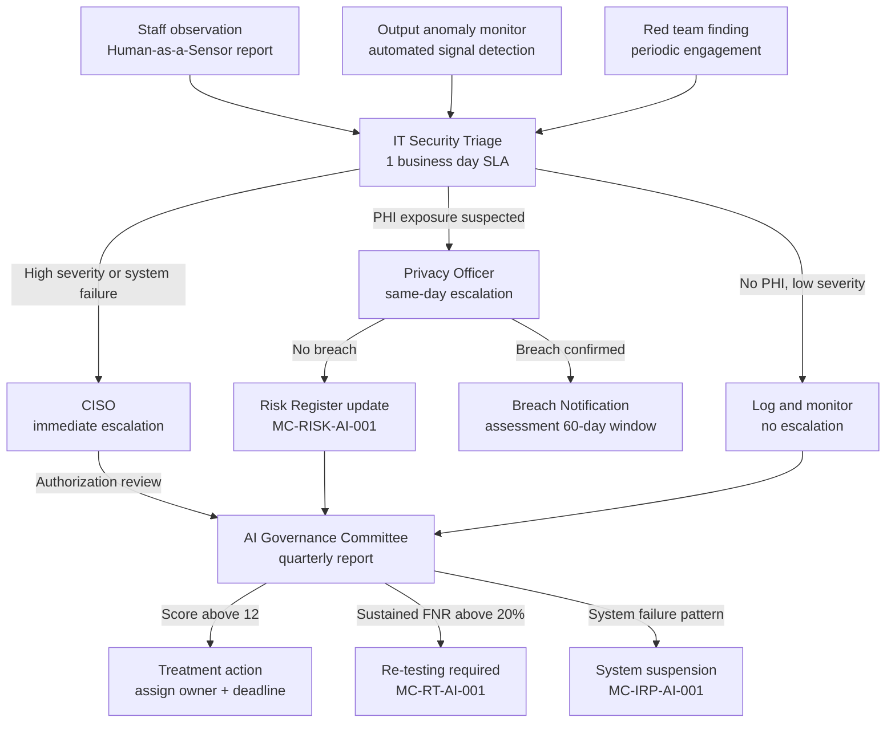

# AI Change Management - NIST AI RMF 1.0
## Project Overview

**Organization:** MedCore Health Systems (fictional)
**Industry:** Healthcare
**Framework:** NIST AI Risk Management Framework 1.0
**Regulatory overlays:** HIPAA, HITECH
**Status:** Complete
**Author:** D'Arcy Bracken
**Timeline:** April 2026 - June 2026

---

## Organization Profile

**MedCore Health Systems** is a fictional mid-size healthcare network consisting of 3 outpatient clinics and a centralized administrative office serving approximately 12,000 patients across Eastern Massachusetts. The organization employs ~150 staff including physicians, nurses, clinical administrators, billing specialists, and IT staff.

MedCore is in the early stages of deploying AI tools across clinical and administrative workflows. Like many healthcare organizations of its size, AI adoption has been driven bottom-up - staff are already using AI tools independently, often without IT awareness or security review.

---

## Why This Project Exists

AI adoption in healthcare is accelerating faster than governance can keep up. MedCore faces three simultaneous pressures:

1. **Clinical staff are using AI tools ad-hoc** - nurses summarizing patient notes with public LLMs, billing staff using AI coding assistants, physicians experimenting with diagnostic support tools. None of these uses have been reviewed for PHI exposure.

2. **Leadership wants to formally deploy AI** - a shortlisted AI diagnostic imaging assistant and an LLM-powered patient intake chatbot are under evaluation. There is no framework to assess their risk before rollout.

3. **Regulatory exposure is real** - HIPAA does not have explicit AI rules yet, but existing Privacy Rule and Security Rule obligations apply fully to AI systems that process, store, or transmit PHI. A data breach caused by an AI system carries the same liability as any other breach.

This project applies the **NIST AI RMF 1.0** to map MedCore's AI risk landscape, establish governance structures, and produce the policy and operational documents needed to manage AI securely throughout its lifecycle.

---

## AI Systems in Scope

| System | Type | Status | PHI Exposure | Risk Level |
|--------|------|--------|-------------|------------|
| DiagnoAI Imaging Assistant | Diagnostic support AI (vendor) | Under evaluation | High (imaging data) | High |
| PatientFlow Chatbot | LLM-based intake/scheduling | Under evaluation | Medium (demographics, symptoms) | Medium |
| ChatGPT / Claude (staff use) | Public LLM | Active - unauthorized | Critical (clinical notes, PHI) | Critical |
| AutoCode Billing Assistant | AI-powered medical coding | Active - limited IT oversight | Medium (billing records) | Medium |

---

## NIST AI RMF Structure

This project follows the four core functions of the NIST AI RMF 1.0:

| Function | Purpose | Project Deliverables |
|----------|---------|---------------------|
| **GOVERN** | Establish accountability, policies, and culture | AI AUP, RACI Matrix, Governance Charter |
| **MAP** | Identify AI use, context, and risk categories | AI Inventory, Shadow AI Discovery Report |
| **MEASURE** | Analyze and assess risk | AI Risk Register, NIST AI RMF Crosswalk (HIPAA overlay) |
| **MANAGE** | Prioritize and treat risk | Red Team Playbook, AI Incident Response Addendum, Workforce Transition Plan |

---

## Deliverables Roadmap

### 01 - Governance (GOVERN)
- [x] [MC-POL-AI-001 - AI Acceptable Use Policy](AI%20Acceptable%20Use%20Policy.md)
- [x] [MC-GOV-AI-002 - AI Governance Charter](AI%20Governance%20Charter.md)
- [x] [MC-GOV-AI-001 - RACI Matrix for AI Governance](RACI%20Matrix.md)

### 02 - AI Inventory (MAP)
- [x] [MC-INV-AI-001 - AI Use Case Inventory](AI%20Use%20Case%20Inventory.md)
- [x] [MC-DISC-AI-001 - Shadow AI Discovery Report](Shadow%20AI%20Discovery%20Report.md)

### 03 - Risk Assessment (MEASURE)
- [x] [MC-RISK-AI-001 - AI Risk Register](AI%20Risk%20Register.md)
- [x] [MC-XWALK-AI-001 - NIST AI RMF x HIPAA Crosswalk](NIST%20AI%20RMF%20x%20HIPAA%20Crosswalk.md)

### 04 - Red Teaming (MANAGE)
- [x] [MC-RT-AI-001 - Red Team Playbook for LLM Systems](Red%20Team%20Playbook.md) (includes MedCore-specific test cases)
- [x] [MC-IRP-AI-001 - AI Incident Response Addendum](AI%20IR%20Addendum.md)

### 05 - Training
- [x] [MC-TRAIN-AI-001 - AI Literacy Program](AI%20Literacy%20Program.md) (clinical + administrative + manager tracks)
- [x] [MC-WFT-AI-001 - Workforce Transition Plan](Workforce%20Transition%20Plan.md) ("Human-as-a-Sensor" model)

### 06 - Templates
- [x] [MC-FORM-AI-001 - AI System Intake Form](AI%20System%20Intake%20Form.md)
- [x] [MC-VEN-AI-001 - AI Vendor Assessment Checklist (blank template)](AI%20Vendor%20Assessment%20Checklist.md)
- [x] [MC-VEN-AI-002 - Azure OpenAI Service Completed Assessment](Azure-OpenAI-Vendor-Assessment.md) (Conditional Approval -- 12 conditions documented)

---

## Continuous AI Monitoring Architecture

The three monitoring components of this program connect into a unified triage and escalation workflow. This diagram shows how a behavioral anomaly detected by any signal source travels through MedCore's governance chain.

**Document owners by node:**
- Staff reporting channel: [MC-WFT-AI-001](Workforce%20Transition%20Plan.md)
- Output anomaly monitor: [MC-RT-AI-001](Red%20Team%20Playbook.md)
- Privacy Officer escalation: [MC-IRP-AI-001](AI%20IR%20Addendum.md)
- Risk Register updates: [MC-RISK-AI-001](AI%20Risk%20Register.md)
- AGC review: [MC-GOV-AI-002](AI%20Governance%20Charter.md)

---

## How This Maps to Existing Work

| This Project | Prior Work (ISMS) | Connection |
|---|---|---|
| NIST AI RMF 1.0 | NIST CSF 2.0 | Same NIST family, same structure logic |
| AI AUP (MC-POL-AI-001) | AUP (FC-POL-001) | Same document type, AI-specific scope |
| AI Risk Register | ISMS Risk Register | Same methodology, AI-specific threat categories |
| Shadow AI Discovery | Vulnerability Assessment | Both identify unauthorized/risky activity |
| Red Team Playbook | Ransomware Playbook | Incident-specific response documentation |
| HIPAA overlay | SOC 2 / GLBA crosswalk | Adding regulatory compliance lens to core framework |

---

## Key Resources

- [NIST AI Risk Management Framework](https://www.nist.gov/itl/ai-risk-management-framework) - primary framework document
- [NIST AI RMF Playbook](https://airc.nist.gov/Docs/1) - implementation guidance
- [OWASP Top 10 for LLM Applications](https://owasp.org/www-project-top-10-for-large-language-model-applications/) - technical threat taxonomy
- [CISA AI Security Guidelines](https://www.cisa.gov/ai) - government/compliance context
- [HHS Guidance on AI in Healthcare](https://www.hhs.gov/about/news/2023/12/14/hhs-publishes-report-congress-artificial-intelligence.html) - HIPAA + AI context
- [AHA AI Playbook for Hospitals](https://www.aha.org/aiplaybook) - healthcare-specific change management

---

## Known Scope Boundaries

The following areas were assessed and intentionally deferred. Deferral decisions are documented here to demonstrate governance maturity knowing what you did not do is part of a credible risk program.

| Deferred Item                            | Rationale                                                                                                                                                                                                                                                                                                                               | Risk if Unaddressed                                                                                                                |
| ---------------------------------------- | --------------------------------------------------------------------------------------------------------------------------------------------------------------------------------------------------------------------------------------------------------------------------------------------------------------------------------------- | ---------------------------------------------------------------------------------------------------------------------------------- |
| FDA SaMD classification for DiagnoAI     | DiagnoAI may qualify as a Class II Software-as-a-Medical-Device (SaMD) under 21 CFR Part 820. If so, 510(k) clearance or the Predetermined Change Control Plan (PCCP) framework applies, changing the primary regulatory posture from HIPAA to FDA oversight. Full SaMD classification analysis is deferred to Phase 2 of this program. | Deploying a Class II SaMD without FDA clearance is a federal violation independent of HIPAA compliance.                            |
| TPRM ongoing monitoring cadence          | MC-VEN-AI-001 covers a point-in-time vendor assessment. Ongoing vendor risk monitoring (SOC 2 renewal tracking, model version change notifications, subprocessor list updates) is not yet operationalized.                                                                                                                              | Vendor risk posture degrades silently between assessment cycles.                                                                   |
| Training data poisoning                  | This program does not assess whether the training data used to build authorized AI systems has been tampered with or introduces systematic bias.                                                                                                                                                                                        | Training data attacks are out of the threat model for this phase, as they introduce the risk of undetected model-level compromise. |
| HHS OCR and FTC enforcement developments | The January 2025 HHS HIPAA Security Rule NPRM and FTC 2024-2025 guidance on AI-enabled deception are active regulatory developments that may change compliance obligations for healthcare AI. This program is built against the current published rules. NPRM provisions are flagged but not yet incorporated as requirements.          | Regulatory posture may be outdated if final rules are published before next program review.                                        |

---

*Built by D'Arcy Bracken, April - June 2026.*

---

## Related

- [Project README](Archive%20Published/AI%20Change%20Mgmt%20RMF/README.md)
